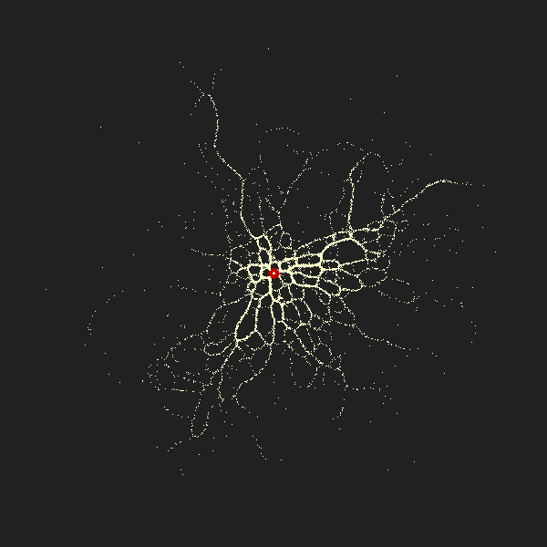

# Physarum Renaissance
After a short break we decided to resume the thread, and write *a fully new code on python*.
* Inspired by this [awesome work](https://www.sagejenson.com/physarum) 
* Consider reading [full version](http://eprints.uwe.ac.uk/15260/1/artl.2010.16.2.pdf) 
* Or see a github [repo](https://github.com/nicoptere/physarum) 
* Another [book](https://vk.com/doc2051067_510754815?hash=6340d9dab83513a13a&dl=a248f8b54b9a5b7b4c)
* Main [article](https://docs.google.com/document/d/1ClbqxgD-cvxd_-Bv_UkfGLSRMU6wBPmJgWGVIAutvJk/edit?usp=sharing) for yandex zen
* A small google-[presentation](https://docs.google.com/presentation/d/19BZZc_2k-FIpkyHzS-j621PmGsNUIOUnv2AHINWfEh8/edit?usp=sharing) made from this [article](http://eprints.uwe.ac.uk/15260/1/artl.2010.16.2.pdf)
* Site with [selection](https://www.sagejenson.com/physarum) from last article
* My summer school [presentation]()



---
This model is also availible with food.
Green spots - food.

---


### Instalation
Setup VisPy OpenGL library:
```
  pip install vispy
```
and one more visualising library:
```
  pip install pyqt5
```
plus, if you don't have numpy library, please install
```
  pip install numpy
```
